# DNS Log Analysis Using Splunk

## Project Overview

This project demonstrates DNS log analysis using Splunk Enterprise. The objective was to investigate DNS traffic, identify failed DNS lookups (NXDOMAIN), analyze source IP activity, and detect suspicious domain queries.

## Objectives

- Import DNS log dataset into Splunk
- Analyze DNS events
- Identify failed DNS lookups
- Investigate suspicious domains
- Analyze source IP activity
- Understand DNS query types
- Practice Splunk SPL queries

## Environment

- SIEM: Splunk Enterprise 10.4.1
- Dataset: Beginner DNS Logs
- Index: dns_project

## Skills Demonstrated

- Splunk Search Processing Language (SPL)
- DNS Log Analysis
- Security Event Investigation
- Source IP Analysis
- Response Code Analysis
- Threat Hunting
- Basic SOC Investigation

## Investigation Summary

- Total Events: **12**
- Successful DNS Responses (NOERROR): **8**
- Failed DNS Responses (NXDOMAIN): **4**
- Most Queried Suspicious Domain: **abcxyz123fake.com**
- Suspicious Source IP: **192.168.1.30**

## Screenshots

### Dataset Imported

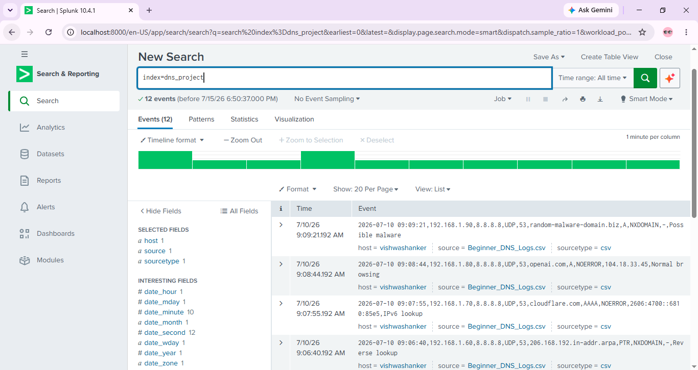

---

### Important Fields

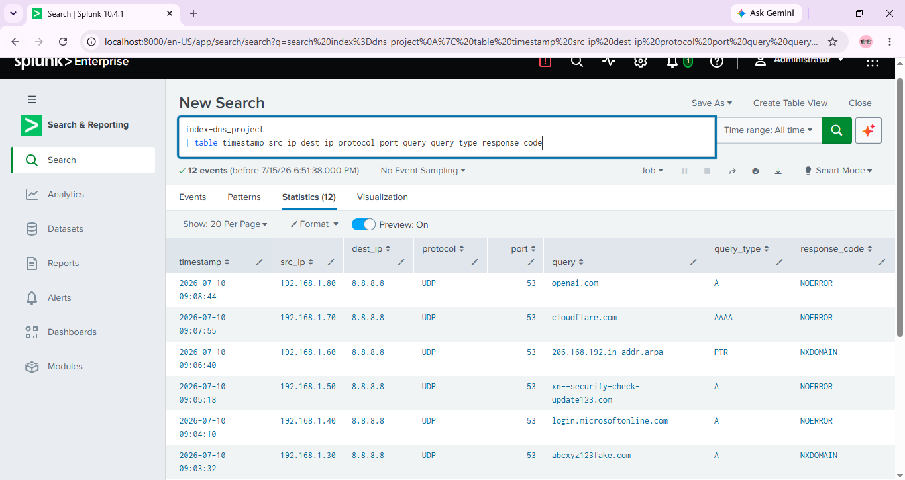

---

### Total Events

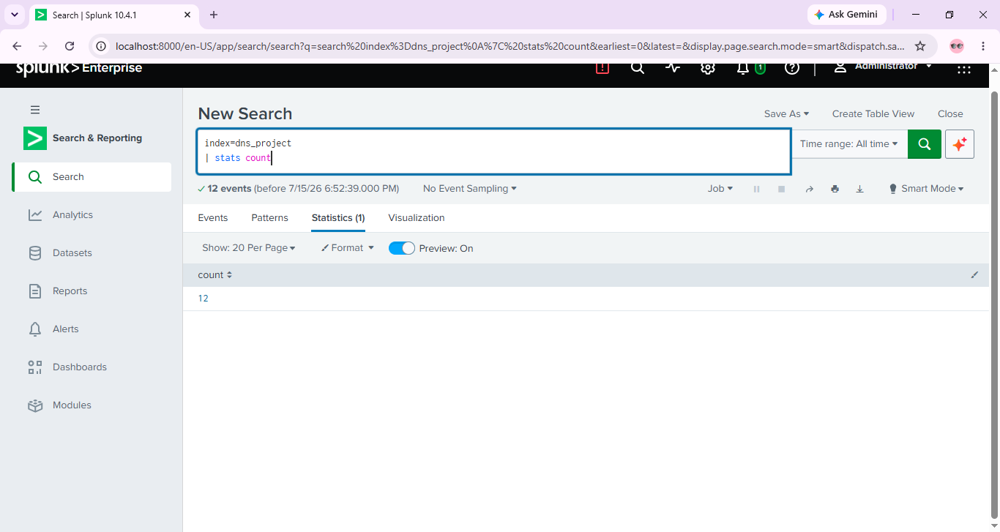

---

### Source IP Analysis

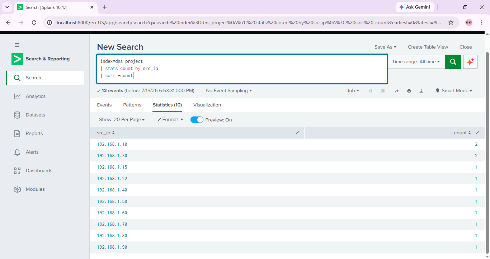

---

### Response Code Analysis

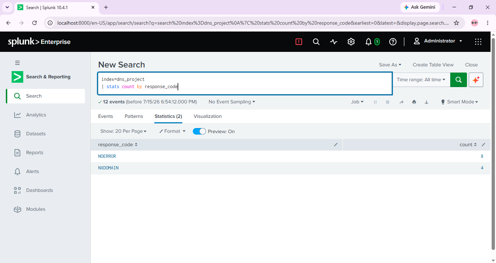

---

### Failed DNS Requests

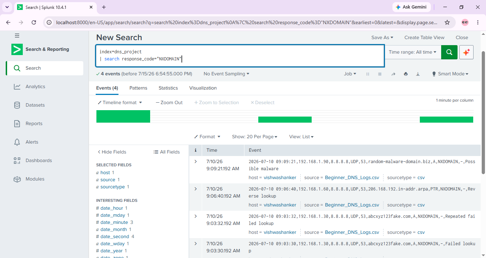

---

### Top Queried Domains

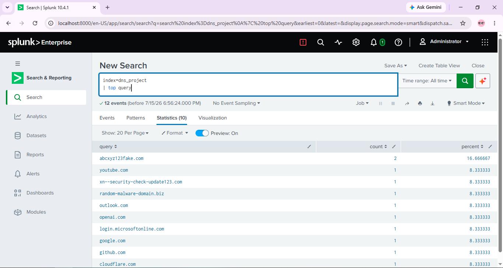

---

### Repeated Domains

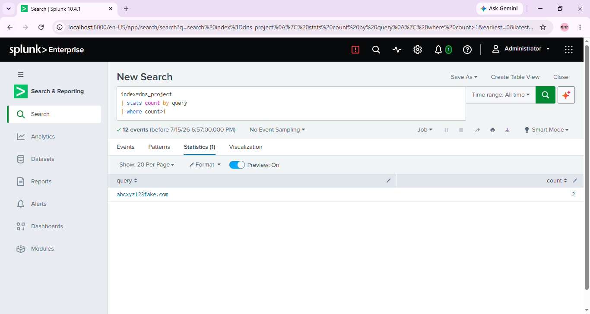

---

### Source IP Investigation

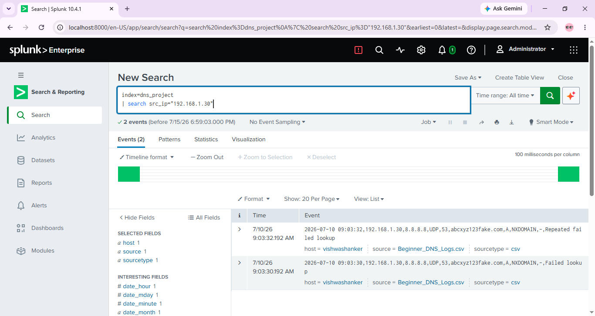

---

### Domain Investigation

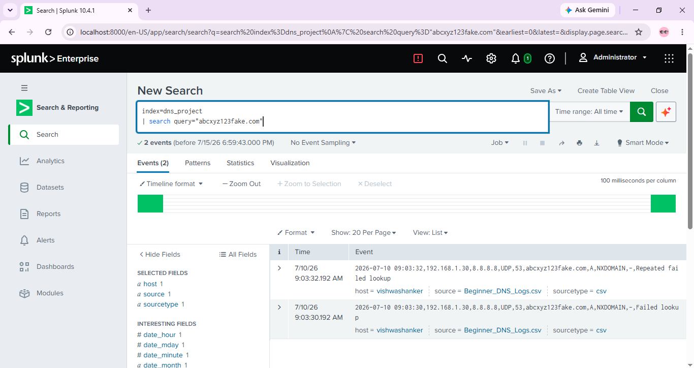

---

### Query Type Analysis

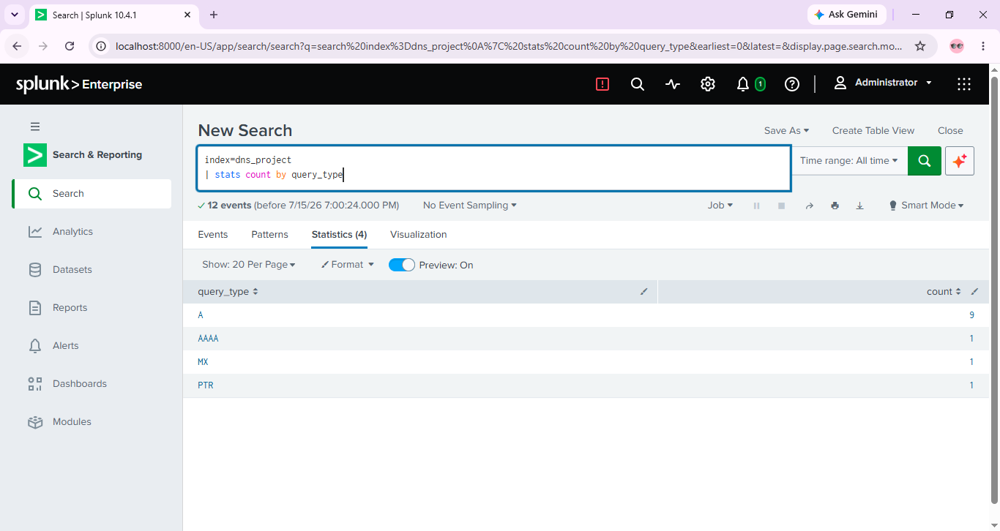

---

## Conclusion

This project demonstrates the use of Splunk Enterprise for DNS log investigation. The analysis identified normal DNS activity, failed DNS requests (NXDOMAIN), repeated domain queries, and suspicious domains that could indicate malicious activity. This project helped strengthen practical SOC Analyst skills using Splunk SPL.
